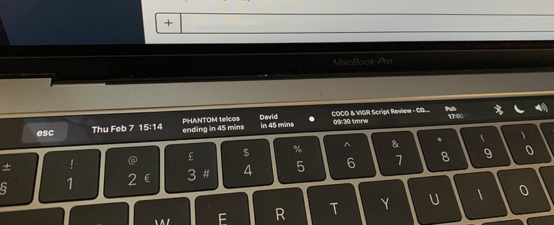
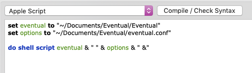
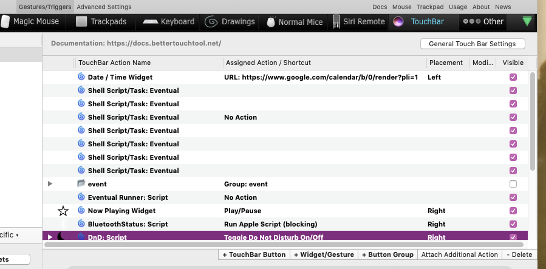
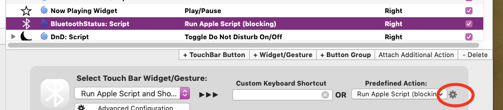

#  Eventual

## Purpose

Eventual is a service that helps [BetterTouchTool](https://folivora.ai/) (BTT) to display a wider range of information on the touch bar of recent Macbook Pros. Unlike solutions which involve BTT repeatedly running scripts, Eventual subscribes to the appropriate native macOS frameworks so that polling is not required. Updates are only pushed when something has changed, ensuring that battery impact is minimal.

Eventual is heavily inspired by the work by [Andrew Chidden](https://github.com/andrewchidden/btt-services). Unlike Andrew's controllers, Eventual has more features, more options to customise its functionality, and it passes data directly to BTT via `http`, rather than using temporary files.

Eventual can do the following:

* Display upcoming calendar events on the touch bar. Multiple calendars are supported, with many different display styles and options. 
* Update icons on the touch bar when the system volume changes. Show the current volume/mute status at a glance, just like the standard system icons.
* Update widgets based on Bluetooth device connections and disconnections. Show the current connection state of your Bluetooth headphones.
* Only use what you need. e.g. if you do not set up a Bluetooth widget, then the Bluetooth service will not run.
* All features can be duplicated, allowing multiple different widgets to carry different info, formatting, etc.

## Installation and Quick Start

Before using Eventual, you must enable the webserver in BetterTouchTool. 

* In BTT, click `Advanced` | `Advanced Settings` | `Webserver` and enable the server. `https` is not currently supported. Set "listen on" to `127.0.0.1` and select a port. Eventual defaults to `60813`. Finally you should set a shared secret.
* Download the latest release binary and config file. Download [`Eventual`](https://github.com/iangray001/Eventual/blob/master/Eventual) and [`eventual.conf`](https://github.com/iangray001/Eventual/blob/master/eventual.conf). I suggest you put then in `~/Documents/Eventual` (where `~` is your home folder).
* Update `bttSecret` in `eventual.conf` to correspond to the shared secret that you set.
* Now add the Touch Bar widgets to BTT. Consult the rest of this document to do this individually, or use the Example set to add a set that shows all the capabilities of Eventual. Open [`example.json`](https://github.com/iangray001/Eventual/blob/master/widgets/example.json), copy the contents of that file, go to 'TouchBar' in BetterTouchTool, and press Cmd-V to paste them in. 

If you put the Eventual binary or configuration file at any location other than `~/Documents/Eventual`, then double click the "Eventual Runner" widget and edit the locations.

The default widget set corresponds to the configuration in the default `eventual.conf`. You can mix and match the widgets and configuration to make Eventual do whatever you want. Details of this are on the rest of this page.

Note that the first time Eventual is run with a calendar widget configured, macOS will ask whether Eventual is allowed to access your calendar events. You should allow this. 

## Usage in BTT

In general, Eventual uses BTT widgets to show things on the touch bar. These widgets are stored as JSON files. To add them to BTT; open the JSON file, copy it to the clipboard, and paste it into the BetterTouchTool touch bar config GUI. 

[The most important widget to add to BTT is the widget that will run Eventual.](https://github.com/iangray001/Eventual/blob/master/widgets/runner.json)

All configurations should include this invisible widget to run Eventual for us. After pasting it in, double click it and at the top of the script window is two variables. Edit these to point to the location of the Eventual binary and the configuration file that you downloaded during installation. 

Once the runner widget is set up, you should add other widgets to act as the outputs for the Eventual services. 

## Service Configuration 

Eventual is configured by providing a path to a JSON-formatted config file on start up. For example:

	Eventual ~/eventual.conf

[An example `eventual.conf` is in the repository](https://github.com/iangray001/Eventual/blob/master/eventual.conf). The top level object contains three important settings.

 * `bttServerName`: This is the protocol, host, and port of the BetterTouchTool web interface, for example: `http://127.0.0.1:60813`
 * `bttSecret`: The shared secret for the web interface.
 * `services`: An array that defines the features of Eventual that you want to use. Each item in the array defines a new service. Services can be duplicated to, for example, output on multiple touch bar widgets or monitor different devices/calendars. For each service you will need to provide the BTT UUID of the TouchBar widget that the service should update. You can find a widget's UUID by right-clicking the widget in BTT and selecting "Copy UUID".

The currently supported services are:

### Calendar Service

Displays a summary of upcoming calendar events. To use this service, insert copies [of this widget](https://github.com/iangray001/Eventual/blob/master/widgets/calendar.json) into your BTT configuration. Each widget will be used to display an upcoming event, so if you want to be able to see up to three events in the future, add three copies. Then for each widget, copy its UUID into the configuration for the calendar service, as described below.

Parameters:

* `type`: Set to `"calendar"`.
* `uuid`: An array of the UUIDs of the BTT widgets to update. (Get by right-clicking the widget in BTT and selecting "Copy UUID"). For example, to display three upcoming events create three widgets and put their UUIDs in this array.
* `calendarNames`: A comma-separated string of calendar names to display on this widget. e.g. `"Main,Work"`.
* `calendarSymbols`: A string of symbols that prefix events based on the calendar from which they come. Events from the first calendar in the `calendarNames` list will be prefixed by the first character in this string. Events from the second calendar will use the second symbol, etc.
* `lookaheadHours`: How many hours into the future to look ahead for events to display.
* `maxNumEvents`: The maximum number of events to display.
* `carriageReturns`: If true, then an event's title and its time will be displayed on different lines. Note: If true, then the font size must be small enough for two lines to be displayed or BTT will only display one. 12pt works well for 2 lines, or 14pt for 1 line.
* `maxEventLength`: Event titles will be truncated to this number of characters.
* `daySeparators`: If true, use bullets to separate events on different days.

### Audio Service

This service sets a widget's icon to reflect the current system volume and mute status. This emulates the standard Apple touch bar so is most useful in full touch bar replacements.

To use this service, insert [this widget](https://github.com/iangray001/Eventual/blob/master/widgets/audio.json) into your BTT configuration, and put its UUID in the configuration for the audio service.

* `type`: Set to `"audio"`.
* `uuid`: An array of the UUIDs of the BTT widgets to update. All widgets are updated identically.

### Bluetooth Service

Sets a widget's icon to reflect whether or not a given Bluetooth device is currently connected. If the device is connected, the Bluetooth logo goes blue (although you could use your own icons if you wish).

To use this service, insert [this widget](https://github.com/iangray001/Eventual/blob/master/widgets/audio.json) into your BTT configuration, and put its UUID in the configuration for the audio service.

* `type`: Set to `"bluetooth"`.
* `uuid`: An array of the UUIDs of the BTT widgets to update. All widgets are updated identically.
* `deviceName`: The device name to reflect the state of. This is shown under the "Devices" section of the system Bluetooth menu.
* `variableName`: The service sets this variable to either "yes" or "no" when the specified device connects and disconnects. Use this variable in the widget's script as described below.

Note: The example Bluetooth widget includes an example Apple Script for connecting to a given Bluetooth device when you press it. If you want to use this, edit the script by selecting the Bluetooth widget and clicking the cog icon in the bottom right of the GUI, as shown in this image:

In the script, change `MA390 Wireless` to the name of your bluetooth device as it appears in the system menu.

## Building

Eventual has no external dependencies so you can build it simply by cloning the repository, installing at least Xcode 10 (or a standalone version of the Swift toolchain), and running:

	swift build -c release -Xswiftc -static-stdlib -Xswiftc "-target" -Xswiftc "x86_64-apple-macosx10.12"

This builds a statically-linked, release version of Eventual for macOS 10.12 or later (by default in `.build/release/`).

